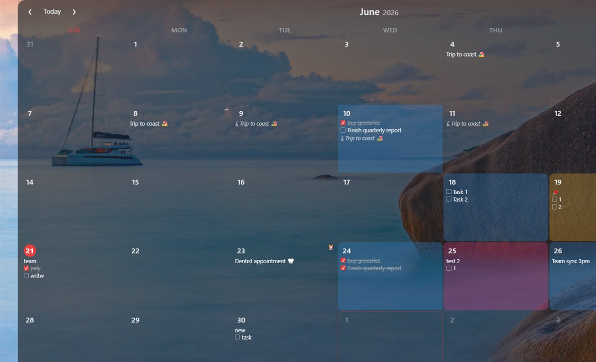

# 🗓️ Desktop Calendar

A lightweight **desktop calendar widget** for Windows that lives on your desktop. Double‑click any day to jot notes and to‑dos, color‑code days, set reminders, and (optionally) sync across your devices. Built with Electron.

> Inspired by desktopcal.com — rebuilt from scratch with reminders, recurring events, multi‑day events, search, natural‑language quick‑add, and cloud sync.



---

## ✨ Features

**Notes & tasks**
- Double‑click a day to add a **note** and/or a **task checklist** (checked tasks get struck through).
- Tick a task right on the calendar cell — no need to open the editor.
- **Emoji picker** in the editor; color‑code any day (right‑click a day for a quick color menu).

**Scheduling**
- **Reminders** ⏰ — set a time per day; get a Windows notification. Optional **lead time** ("10 min before") and **snooze** (re‑notify until acknowledged).
- **Recurring events** 🔁 — daily / weekly / monthly / yearly, with **per‑occurrence skip / edit**.
- **Multi‑day events** ↔ — give a note an end date; it spans the range.
- **Roll over** unfinished tasks to today automatically.

**Navigation & finding things**
- Click the month/year to **jump** anywhere; **keyboard nav** (`←↑↓→`, `PageUp/Dn`, `T` = today).
- **Search** (`/`) across notes & tasks; **Upcoming agenda** (`A`) for the next 30 days.
- **Natural‑language quick add** (`N`): e.g. `lunch fri 1pm 🍔`, `dentist tue 9:30am`, `report in 3 days`.

**Appearance & desktop behavior**
- Light/dark theme, font family & size, bold/italic, day/week spacing, week numbers, cell borders, weekend highlight.
- **Background opacity** that keeps text fully readable (only the background goes translucent).
- **Pin to desktop** — sits behind your other windows like a wallpaper widget, but stays clickable (press `Ctrl+Alt+C` to bring it forward).
- **Lock** position & size (🔒 button, top‑right), start with Windows, always‑on‑top.

**Data & sync**
- Local JSON storage + **automatic daily backups** (last 7 kept).
- Optional sync via **OneDrive / Google Drive folder**, or **Firebase account login** with realtime push sync across devices.
- Export / import your data as JSON.

---

## 🚀 Install

### Option A — Installer
Grab `Desktop Calendar Setup <version>.exe` from the [Releases](../../releases) (or the `dist/` folder if you built it) and run it.

> The build is **self‑signed**, so Windows SmartScreen may say "unknown publisher" → *More info → Run anyway*. Some antivirus (e.g. AVG) may quarantine an installer‑dropped exe; if so, use the portable install below or add an exclusion.

### Option B — Build & run from source
Requires **Node.js 18+**.

```bash
git clone https://github.com/khvrnz/Deskcal.git
cd Deskcal
npm install
# (Optional) enable cloud sync — see "Cloud sync setup" below:
cp src/firebase-config.example.js src/firebase-config.js   # then fill it in
npm start                  # run the app
npm run build              # build the signed NSIS installer into dist/
npm run install:local      # copy-install + Start Menu/Desktop shortcuts (AV-friendly)
```

> If `npm install` doesn't download the Electron binary (sandboxed environments), run `node node_modules/electron/install.js`.

---

## 📖 How to use

| Action | How |
|---|---|
| Add / edit a day | **Double‑click** the day |
| Quick task tick | Click the checkbox on the day cell |
| Color a day | **Right‑click** the day |
| Jump to a month | Click the **"June 2026"** title |
| Today | Click **Today** or press **T** |
| Move selection | **Arrow keys**; **PageUp/PageDown** = prev/next month |
| Search | **🔍** button or **/** |
| Upcoming list | **📋** button or **A** |
| Quick add (natural language) | **➕** button or **N** — `team sync mon 3pm` |
| Move an event | **Drag** a day onto another day |
| Lock / unlock layout | **🔒** button (top‑right) |
| Settings | **⚙** button |
| Show when pinned | **Ctrl+Alt+C**, or the tray icon → Show |

The app keeps running in the **system tray** when closed. Right‑click the tray icon for Show / Pin to Desktop / Lock / Start with Windows / Quit.

### Reminders
Open a day → set **Remind at**. The app must be running (it lives in the tray; enable *Start with Windows* to keep it up). Configure global **lead time** and **snooze** under Settings → Reminders & tasks.

### Recurring & multi‑day
In the day editor: **Repeat** (never/daily/weekly/monthly/yearly) and **Ends on** (for multi‑day). Opening a repeated occurrence lets you **Edit series** or **Skip this day**.

---

## ☁️ Cloud sync setup (optional)

The app works fully offline. For sync you have two choices:

**1. Folder sync (simplest):** Settings → Account & sync → pick **OneDrive** or **Google Drive**. Your notes are stored in that synced folder, so any device signed into the same drive account stays in sync. No accounts to create in‑app.

**2. Firebase login + realtime sync:** baked‑in account login with sub‑second push sync across devices.

To enable Firebase (developer, one‑time):
1. Create a Firebase project; **Authentication → Sign‑in method → enable Email/Password**.
2. **Realtime Database → Create database**, then set its **Rules** so each user only touches their own data:
   ```json
   { "rules": { "calendars": { "$uid": {
     ".read": "auth.uid === $uid", ".write": "auth.uid === $uid" } } } }
   ```
3. Copy `src/firebase-config.example.js` → `src/firebase-config.js` and fill in your **Web API Key** + **databaseURL**.
4. `npm run build`. End‑users just open the app → Settings → **Create account / Sign in** → done.

> The Firebase **Web API key is not a secret** (it ships in every client; security is enforced by the database rules). Even so, `src/firebase-config.js` is **gitignored** so it never lands in a public repo.

---

## 🛠️ Project layout

```
src/
  main.js            Electron main process (window, tray, reminders, sync, backups)
  preload.js         contextBridge IPC API
  desktop-pin.js     "pin to desktop" (sink behind windows, stay interactive)
  cloud-sync.js      OneDrive / Google Drive folder detection
  firebase-sync.js   Firebase Auth (REST) + Realtime DB (SSE) sync engine
  firebase-config.js your baked config (gitignored; see *.example.js)
  renderer/          UI (index.html, styles.css, renderer.js)
scripts/
  make-icon.js       generates build/icon.ico (no deps)
  sign.ps1           Authenticode-sign the build (self-signed)
  install-local.ps1  copy-install + shortcuts (bypasses AV NSIS quarantine)
```

Data lives at `%APPDATA%\desktop-calendar\deskcal-data.json`; daily backups in `…\backups\`.

---

## 📦 Build scripts

| Command | Does |
|---|---|
| `npm start` | Run the app |
| `npm run build` | Generate icon + build NSIS installer into `dist/` |
| `npm run sign` | Authenticode‑sign the installer & app (self‑signed) |
| `npm run install:local` | Copy‑install to `%LOCALAPPDATA%\Programs` + shortcuts |

---

## 📝 License

MIT — see [LICENSE](LICENSE).
